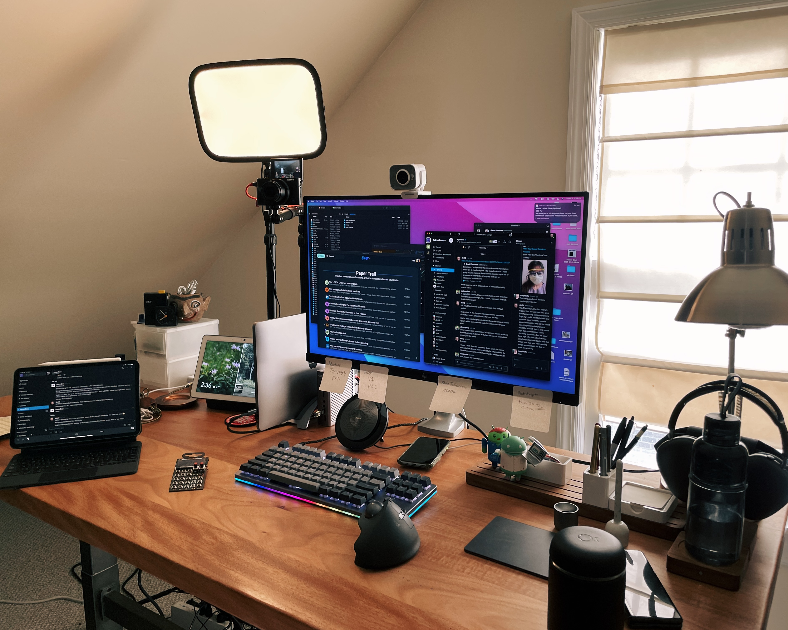
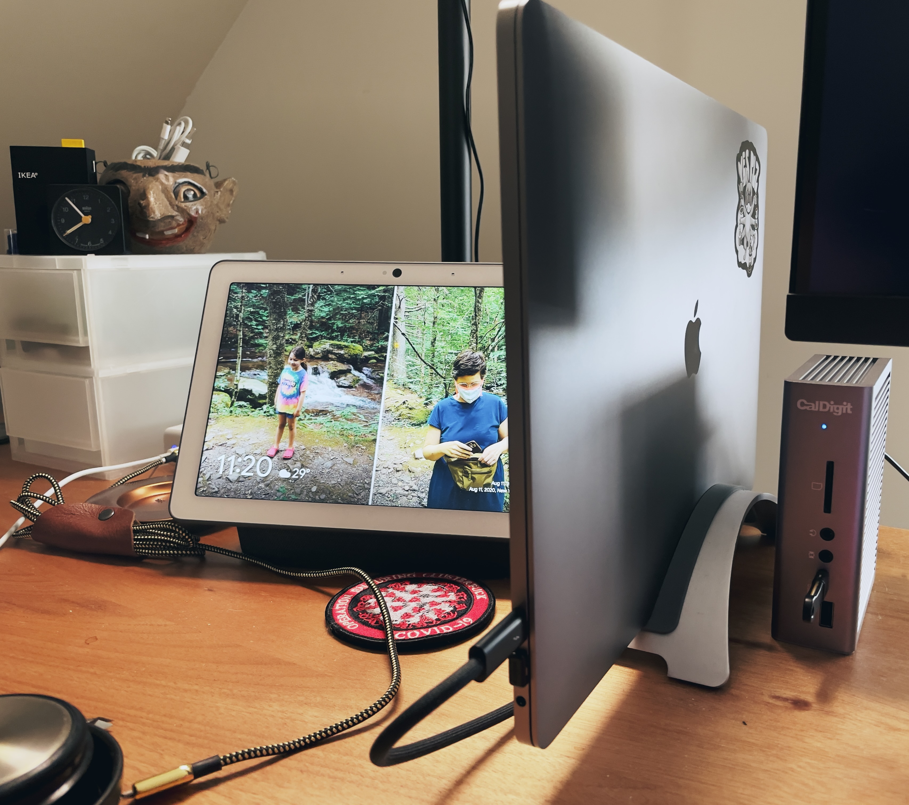
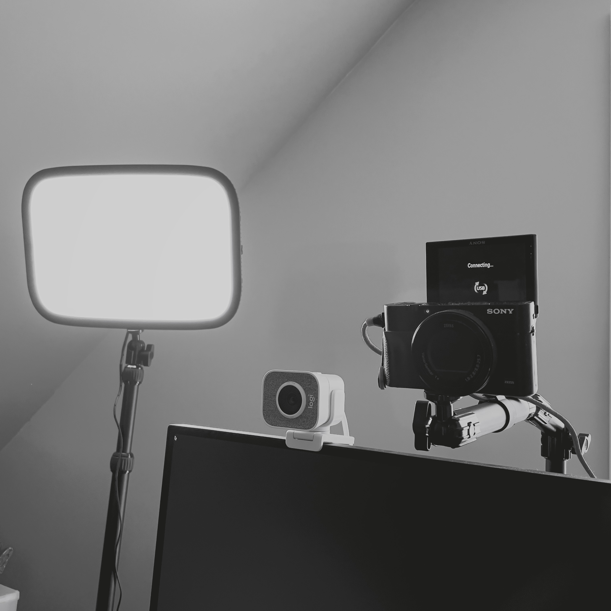

_[record scratch]_ Yep, this is <del>me</del> my desk. Perhaps you’re wondering how I got here.

Like everyone, I’ve been working from home for nearly a full year due to the COVID-19 pandemic. This past year hasn’t been my first go-around working remotely — I did it for the first six of my seven years working on Typekit, and before that as a freelance web developer in the ‘00s. Really, over my career, I’ve spent more time working from home than from offices. When COVID happened, and we all found ourselves having to set up _ad hoc_ workspaces for what we hoped would be weeks, feared would be months, and will turn out to have been a year plus, I was in a better position than most.

I love gadgets, and I’m a perfectionist. I’ve tinkered with my desk setup regularly for years, and it’s not like I’ve had opportunities to do much else these days besides taking Google Meet calls and tinkering with stuff. I’ve replaced or tweaked almost everything on the desk since last March. Honestly, life would be easier (and cheaper!) if I could just buy some equipment and be satisfied with it, but that's not how my brain works.

So here I am, with a boxful of keyboards, everything mounted on ergonomic arms that can be mounted, and a pro-level video setup. Let me tell you about my journey.

## The Right Laptop for a Pandemic

My main work machine is a 16” MacBook Pro with 32 GB of memory and an upgraded graphics card. To be honest, I only need this much computer for Chrome tabs and Google Meet calls, and I don’t need the 8-core processor or enormous pile of RAM as much as I need a graphics card.

At the start of the pandemic, my main work laptop was a 2018 MacBook Air — an okay machine for working on docs on the train or presenting from a conference room, but less suited to serve as a long-term desktop replacement. The old Intel-based Air gets sluggish when you ask too much of it — it can do a Google Meet call, edit a Google Doc, and connect to an external monitor, but not all three at the same time, and sometimes even two is pushing it. (Also, as it happens, my Air had the old, bad keyboard, whereas the Pro has the new, better keyboard.)

## USB-C Is Still Terrible

At my desk — which is an [Uplift motorized sit-stand desk](https://www.upliftdesk.com/adjustable-height-desks/) I bought with my company’s generous WFH gear stipend — I keep the laptop in a [TwelveSouth BookArc](https://www.twelvesouth.com/products/bookarc-macbook?variant=31443535724601) stand. It’s connected to a [CalDigit Thunderbolt 3 dock](https://www.caldigit.com/ts3-plus/) (the same model [Wirecutter recommends](https://www.nytimes.com/wirecutter/reviews/best-thunderbolt-dock/#what-to-look-forward-to) and [Apple sells](https://www.apple.com/shop/product/HMX12ZM/A/caldigit-ts3-plus-dock?afid=p239%7C10078&cid=aos-us-aff-ir)) and from there to an [HP Z27 4K display](https://www.walmart.com/ip/HP-Z27-27-inch-4K-UHD-Display/834276976?irgwc=1&sourceid=imp_Uz7zeW3bjxyLW6pwUx0Mo371UkEWKJXJo2SzQ40&veh=aff&wmlspartner=imp_197432&clickid=Uz7zeW3bjxyLW6pwUx0Mo371UkEWKJXJo2SzQ40&sharedid=&affiliates_ad_id=565706&campaign_id=9383). That display is mounted to the desk with a [Fully Jarvis monitor arm](https://www.fully.com/jarvis-monitor-arm.html), which lets me position the screen higher when I’m standing and lower when I’m sitting.

I am a stickler for only having to plug one wire into my laptop. Two wires are an annoyance; three are a failure. The Z27 has a built-in USB-C hub, and in theory, it should be able to connect directly to my laptop and do everything. 

But USB-C, it should be said, is a hot, fiery mess. Even power delivery — USB-C’s most straightforward job — is problematic: different devices need different wattages, and when given the wrong wattage will charge slowly or not charge at all. And of course, none of this is labeled, so you just have to know that (for example) [Apple’s newest iPhone cables will charge at full speed at 20W, but not 19W](https://daringfireball.net/linked/2020/10/27/magsafe-20w-charger).

Thunderbolt devices conform to higher, more consistent specs than generic USB-C ones, so my Thunderbolt dock’s performance has generally been more consistent and less flaky. Of course, the trade-off is that I had to buy an extra $200–300 device rather than use the free USB-C hub built into my display. Also, many Thunderbolt cables are annoyingly short, so I upgraded to [Apple’s Thunderbolt Pro Cable](https://www.theverge.com/2020/7/27/21339861/apple-thunderbolt-3-pro-cable-specs-price-available) — the longest high-performance cable on the market — which was another $130.

All that’s to say: USB-C is an annoying garbage fire that you can mostly fix by throwing money at it. I hope some company is working on bringing lower-cost Thunderbolt 4 gear to market because this is untenable.

BTW, also pictured above is [Google’s Nest Hub Max](https://store.google.com/us/product/google_nest_hub_max), which I originally bought to help solve my MacBook Air video chat problems — it can connect to Google Meet or Zoom, though its camera has an absurdly wide-angle lens that makes calls look like a hip-hop video from the ‘90s — and now mainly use for controlling my office lights and watching _WandaVision_.

## Video Conferencing

Maybe I’m weird, but I’ve largely ignored the whole Twitch thing. Perhaps it’s part of my particular introversion, but I’m just not as into watching people’s random talking-head videos as other folks seem to be. I hadn’t really been exposed to all the ridiculous gear folks use to capture video of themselves sitting at their desks, ideally surrounded by colored accent lights. But then I read [Michael Lopp’s essay about his video conferencing setup](https://randsinrepose.com/archives/good-meetings-are-jazz/), where he writes:

> I, like you, am stuck in this box on your screen—this [is] my life now. I still have all the same meetings with all the same people, but we’re all stuck in our respective boxes, and we’ve got work to do. Together. Right now.
> Remember in-person meetings? The audio-video quality of in-person meetings is excellent. It’s the quality bar. It allows us to see and hear subtle aspects of human interaction. It allows us to work better as a group. A well-run brainstorming meeting with a group of humans is comforting jazz. The equivalent meeting in a video conference is a master class in how technology gets in the way of humans effectively communicating, collaborating, and being creative at scale.

As a product manager for a distributed team, my work is almost all meetings, so beyond being yet another fun pandemic project, upgrading my AV setup is a way to bring more immediacy and life to interacting with folks and make hours of daily Meet calls a little less of a slog.

Like Rands, I started out with a fancy webcam — a [Logitech StreamCam](https://www.logitech.com/en-us/products/webcams/streamcam.960-001289.html), which has a bigger sensor and lens than most other webcams — paired with a podcast-friendly USB microphone ([Blue Yeti X](https://www.bluemic.com/en-us/products/yeti-x/)) and [wired Master & Dynamic MH40 headphones](https://www.amazon.com/gp/product/B00Q3ELGUU/ref=ppx_yo_dt_b_search_asin_title?ie=UTF8&psc=1). This setup was fine and definitely an improvement over a laptop camera and AirPods combo.

But on the audio front, I started to get tired of having headphones on or in my ears all day and wanted to replicate the feeling of being in a conference room with excellent, full-duplex audio. I’m fortunate that I have a dedicated office space with a door that closes, so I bought a [Jabra Speak 710 USB speakerphone](https://www.jabra.com/business/speakerphones/jabra-speak-series/jabra-speak-710##7710-409), which has worked great for all my calls. (On the occasions when I have to share my office space with my six-year-old doing virtual school, I switch to my fancy [AirPods Max](https://www.apple.com/airpods-max/).)

For video, the Streamcam is actually fine. But then [Sony shipped a Mac app that allows any of their mirrorless cameras to be used as webcams](https://support.d-imaging.sony.co.jp/app/webcam/en/), so I switched to using the [RX100 VA](https://www.dpreview.com/news/8036228182/sony-replaces-rx100-v-with-rx100-va-bringing-rx100-vi-processor-and-firmware) I’d bought for traveling, and I got hooked. Right now, I have the Sony camera mounted on an [elgato Flex Arm](https://www.elgato.com/en/flex-arm), keeping it positioned above my screen for maximum eye contact with people during meetings. The RX100 has a relatively fast built-in Zeiss lens; with good lighting, I can open it all the way up to f/2.4 and get great bokeh for a lovely natural background blur effect.

You might be wondering — if the Sony camera is so great, why do I still have the Streamcam sitting atop my monitor? Mostly laziness (its cord is in a cable-management thing that I don’t want to unwind), but also once a month I have a telemedicine appointment, and my doctor’s video chat app doesn’t work with the Sony webcam software. 🤷🏻‍♂️

Speaking of lighting: I bought the same lighting rig Rands uses — [elgato’s Key Light](https://www.elgato.com/en/gaming/key-light), a desk-mounted LED panel you can control from your phone — to replace the random LED desk lamp I’d been using for years.

Though I am a naturally messy person, once I’d invested in a nice camera image (and once the holidays left me with a bunch of giant Lego sets that needed storage), I decided to work on improving what folks saw behind me. So I set up a row of [IKEA KALLAX shelving units](https://www.ikea.com/us/en/cat/kallax-series-27534/), neatly arranged behind my Peloton bike, with my [Disney Castle](https://www.lego.com/en-us/product/the-disney-castle-71040) and [Diagon Alley](https://www.lego.com/en-us/product/diagon-alley-75978) sets displayed as an art piece I call “The Lost City of Orlando.” The shelf also has my copy of _[The Power Broker](https://www.nytimes.com/2020/05/28/nyregion/power-broker-tv.html)_ as an Easter egg.

## Don’t Get Me Started About Keyboards

Seriously, don’t, we’ll be here all day.

At the moment, I’m using the [Drop CTRL mechanical keyboard](https://www.amazon.com/Massdrop-CTRL-Mechanical-Keyboard-Programmable/dp/B07W4SNVXD) with Halo True switches. The CTRL is more or less identical to [Input Club’s K-Type keyboard](https://input.club/k-type/), which those two companies had co-produced before a falling-out that resulted in the keyboard and Halo switch designs being owned by Drop. My K-Type is still at Google’s NYC office, waiting for COVID rates to finally get low enough for them to let me come claim my stuff, so I bought a CTRL for my home office.

Being a keyboard fiend, I will sometimes swap in a different “fun” board for a few minutes (then get frustrated and switch back). Most often these are another Input Club keyboard, the [Nightfox](https://kono.store/products/nightfox-mechanical-keyboard), or my latest acquisition, the [Keyboardio Atreus](https://shop.keyboard.io/collections/keyboardio-atreus/products/keyboardio-atreus).

As for my mouse, right now I am using both a [Logitech MX Ergo Plus](https://www.logitech.com/en-us/products/mice/mx-ergo-wireless-trackball-mouse.html) trackball — I don’t have RSI and I’d like to keep it that way — and an [Apple Magic Trackpad 2](https://www.apple.com/shop/product/MJ2R2LL/A/magic-trackpad-2-silver), the latter mainly for gestures and sometimes for scrolling.

Just as important as my keyboard and mouse are pens and paper — I am terrible at taking well organized digital notes while talking to someone, so I jot down a lot of sticky notes. I keep a stack of [Baron Fig Nomad dot-grid stickies](https://baronfig.com/accessories/nomad?title=default%20title) close at hand, along with a couple of [Baron Fig Squire pens](https://baronfig.com/tools/squire), all neatly stored in [Ugmonk’s Gather desk organizer](https://ugmonk.com/collections/gather/products/gather-basic-set-walnut?variant=19421959782457) (which also holds my phone charger and a stand for my AirPods).

Finally, another thing I keep on my desk are toys — both for decoration, and to fidget with during calls. If you’re ever on a meeting with me, know that while you’re speaking I am probably on mute, pressing random buttons on a [Teenage Engineering Pocket Operator that makes Street Fighter sounds](https://uncrate.com/teenage-engineering-street-fighter-pocket-operator/).

Don’t worry — I am totally paying attention.

## Lastly, My 15-Year-Old Chair

[Ladies and gentlemen of the class of '97](https://en.wikipedia.org/wiki/Wear_Sunscreen): **buy a good chair**. If I could offer you only one tip for the future, good chair would be it.

When I landed my first big freelance contract, I splurged on a brand-new [Herman Miller Aeron chair](https://www.hermanmiller.com/products/seating/office-chairs/aeron-chairs/) for my first proper home office. This is the same chair I still use today, fifteen years later. (Technically it’s still true that I tweaked everything on my desk this past year, because the chair is not on my desk.) The Aeron’s signature feature, and what I like best about it, is that its seat and back are made of a highly supportive, breathable mesh. My attic office space isn’t hooked up to our central A.C., so the mesh helps me stay cool and get the benefits of the window unit I use during hotter times. Year-round it helps prevent sweatiness and is just super comfortable for long stretches of sitting.

Despite having been on the market since 1994, the Aeron is still good enough that [Wirecutter has it as their runner-up pick](https://www.nytimes.com/wirecutter/reviews/best-office-chair/#runner-up-herman-miller-aeron). There are other $1,000-ish desk chairs that can compete with it, many of which are more adjustable or customizable.

But I’m very happy with the Aeron. It’s one part of my desk setup I never, ever think about changing. 

Any table will work as a desk, but the wrong seat will have you hunched over your computer or leaned too far back, suffering from neck strain, back strain, eye strain, or all three. Spend whatever you need to, or whatever you can. Generally speaking, I recommend buying a used or refurbished Aeron (or Embody, or the like) over brand-new chairs in the same price range. These chairs last for years and years, and while several hundred dollars is a lot of money for most people, your back and butt (and your future self’s healthcare budget) will thank you for it.
