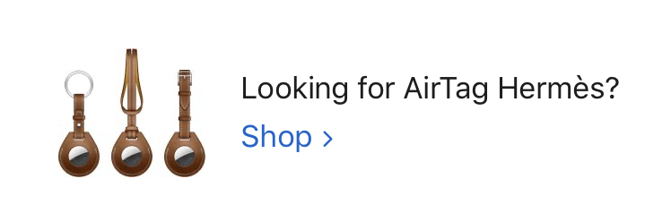
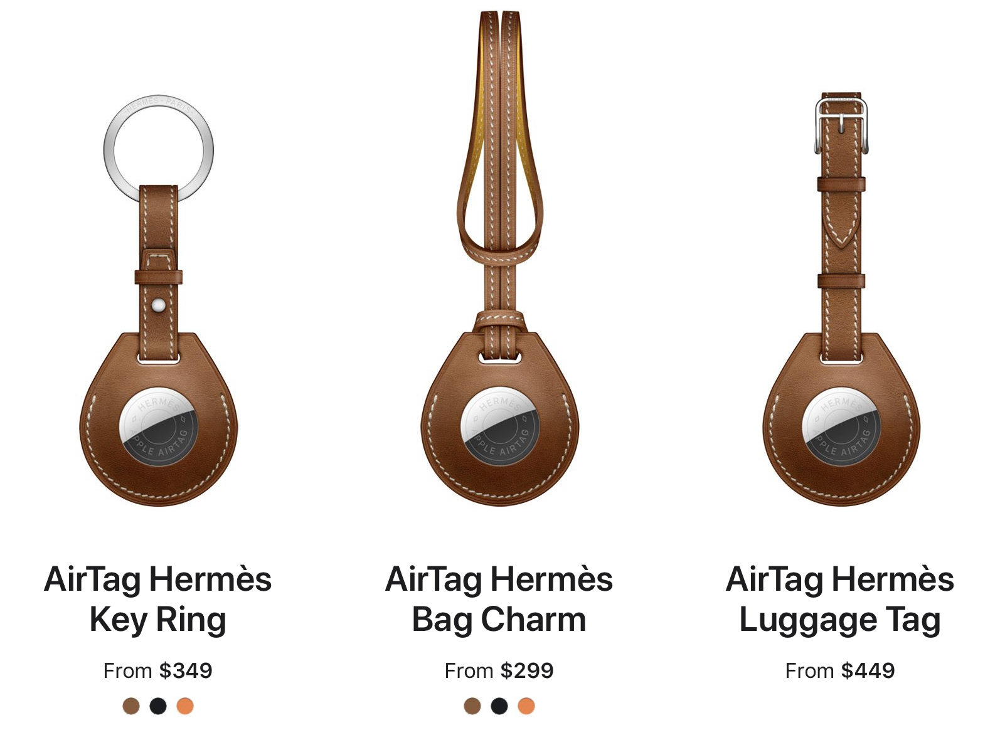
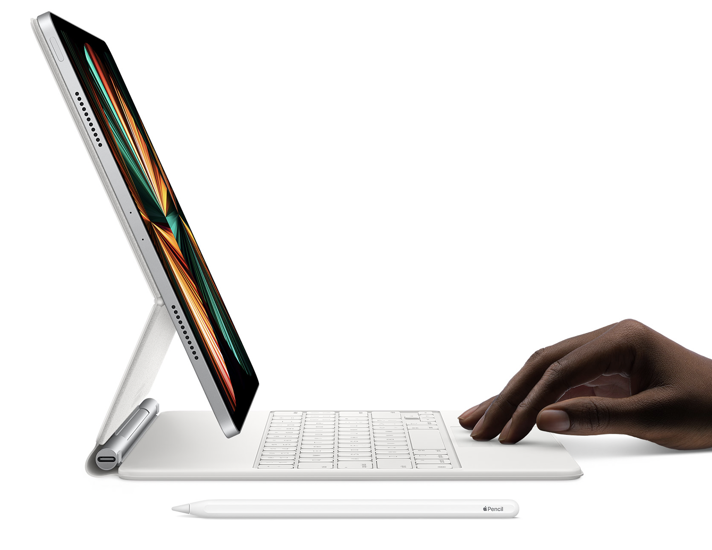
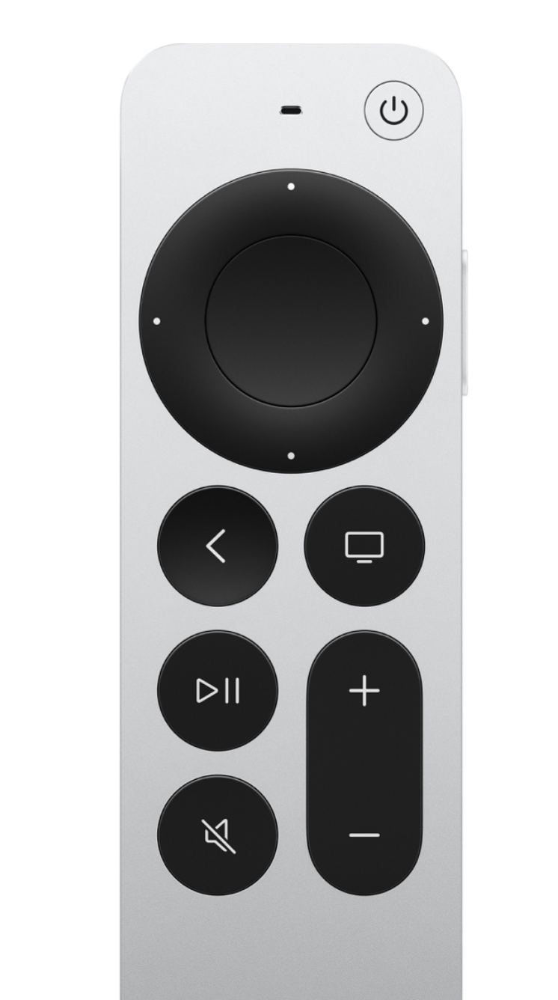

It’s that time again — Apple has announced products, and now we will talk about the products that were announced!!!

I did not watch today’s event live, because I had other things going on: my newly vaccinated in-laws are visiting, I had to pick up lunch carryout, the dog needed walking, and then I had a meeting. I kept one eye on _The Verge_‘s liveblog, and have spent a chunk of the afternoon catching up on everything, so I may have missed some stuff and, if so, will update this post with additions or corrections as needed.

<figure class="wp-block-image"></figure>

<h2>AirTags</h2>

_Finally_. Apple’s Tile-like location tracking dinguses have been rumored for years, and [now they’re here](https://www.apple.com/airtag/). I like that they’re relatively inexpensive ($30, or $99 for four), and I like that you can get them personalized. I’m less wild about how keychain or lanyard attachments cost extra — on one hand, it means you can choose how they attach to your stuff, but on the other, it’s more money on top of the cost of the tracker. (At least the battery is replaceable!)

Another way of looking at AirTags’ pricing and pitch: Apple will bring the “play a sound or look at a map to find that thing” feature from your iPhone to any object you can attach a small round puck to, for as little as $30, which seems like a bargain after the hundreds or more you’re already paying for a phone.

[Tile’s trackers start at $25](https://www.thetileapp.com/en-us/products), and while they do have a lanyard loop, they are bigger, less personalizable, and more utilitarian-looking than AirTags. Not to mention, they aren’t nearly as well integrated into Apple’s ecosystem.

Before Covid, when I left the house regularly and there was a non-zero chance I might leave my keys at the office, I used to keep a Tile Pro on my key ring. It worked okay, but the Tile app had a bad habit of alerting me that I’d left behind my keys anytime I walked more than a block from my house without them. I told it that home was a normal place for them to be… but then it started to think that the keys were a few doors from my house because that was where my phone lost the Bluetooth signal.

If nothing else, I expect Apple to do quite a bit better at that, for only a bit more money, and an AirTag will look like a nice, engraved steel keychain to boot.

Speaking of nice steel keychains, check this out hiding at the bottom of the pricing page for the very affordable and accessible AirTags:

<figure class="aligncenter size-large is-resized"></figure>

<figure class="wp-block-image size-large"></figure>

Confession time: I actually own [an Hermès strap for my Apple Watch](https://www.apple.com/shop/product/MX2P2AM/A/apple-watch-hermès-40mm-noir-swift-leather-single-tour?fnode=baaa9e286156d9e1ee656577630c20dce49f53bd9f8648c58e904076d11f45b3ef87f60c57fe05e0d39f4c46348a1cb369256e6f14237fa1ff38ab3c50e53c2e97dc2258170db6b274a957425f5db38d). It was over $300, and it’s easily the best watch band I own — the leather is supple, and unlike some other, far cheaper leather goods I own, it actually _has_ gotten more supple and better looking with time and wear.

That’s to say, I’m willing to grant that a Hermès leather-encased AirTag with an exclusive Hermès engraving is something someone would pay $350 for. I’m not quite there — I think these look pretty hot, but it took four or five years for me to work up to wanting a luxury Apple Watch strap, and AirTags are -1 week old.

I did just pre-order [Nomad’s AirTags glasses strap](https://nomadgoods.com/products/airtags-glasses-strap?utm_source=pepperjam&utm_medium=affiliate&utm_campaign=120661&utm_content=2-457219&clickId=3546022955), because as ridiculous as I may look having a glasses strap (at all, let alone one with a tracker on it), I feel more ridiculous when I lose expensive sunglasses (again).

<h2>The next iPad Pro</h2>

I gotta hand it to Apple: they’ve now stuck with the same form factor and accessories for the iPad Pro for not one, not two, but _three_ years. (Well, almost.) This is the fourth iPad model that works with the Pencil 2, and the third that will work with the Magic Keyboard. If you (like me) have spent $400 or more on iPad Air/Pro accessories, but worry that someday Apple’s designers will get bored and make you buy new stuff that’s only a millimeter larger or smaller, like they do with iPhone cases every year, well, we dodged that bullet for another year.

<figure class="wp-block-image size-large"></figure>

Apple’s big headline for these iPads is that they are powered by the same M1 processors as new Macs, and in fact support the same Thunderbolt 4/USB4 connectivity. They are, in essence, tablet-shaped Macs that run iPadOS — or are the new Macs laptop-shaped iPads that run macOS?!

It is unclear what Apple thinks we’ll do with all this power. They say the new iPads have “console-quality graphics”, but they’ve been saying that for years. It’s been true for years! But nobody is using an iPad as a PS5-replacement, even if it’d be fine at it. Maybe there’s something waiting in the wings, maybe Apple (as ever) is hoping the ecosystem will make fetch happen with these devices if the specs get good enough.

Currently, I’m using an 11″ iPad Pro from 2018. I’m a little bit interested in these new models, especially the extra-bright XDR screen on the new 12.9″ Pro. But I’m also quite happy with my 11″ — it’s plenty fast enough for me, and while I am certain this new iPad can do more than my current one, I have no idea if I _need_ more. (Also, on the topic of those accessories I’d rather not buy again: I have a $299 sunk cost, in the form of the 11″ Magic Keyboard, incentivizing me to stay on the 11″ iPad.)

But you know, that’s probably fine. The iPad is what it is, and Apple seems to be OK with that.

<figure class="wp-block-image alignwide size-large"></figure>

<h2>The new M1 iMac</h2>

The other day I was thinking about what Macs, if any, Apple might announce now, with the Apple Silicon platform still very new, amid a massive global chip shortage.

And that got me thinking about the iMac, which started out as Apple’s flagship computer for families and everyday users, but has ended up their _de facto_ pro model for most use cases, owing to the Intel-based ones having very robust specs (not to mention the only 27″ 5K Retina displays in the industry). Before the last big chip transition, anyone with any sort of demanding use case needed a Power Mac G5, and the rest of us could get by with an iMac. In the Intel era, eventually Mac Pros became absurdly high-end supercars, while iMacs gradually became powerful enough to do all but the most demanding work. The short-lived iMac Pro, which Apple apparently made as a stopgap to tide those highest-end users over until the current, absurdly powerful and expensive, Mac Pros were ready, was one of the best Macs Apple ever shipped.

Now, with these new M1 iMacs, we have a return to the original concept for the product: a simple, beautiful, impeccably designed computer for everyday use. That idea extends even to the display: it only comes in one size, around 24″, which is not big enough for the kinds of pro workflows iMacs had found themselves in, but perfectly fine for home use.

Like the other M1 Macs, the new iMac will probably be absurdly fast, but with something of a performance ceiling especially when asked to do sustained high-CPU work. They seem like great computers, which if anything only whets one’s appetite more for what kinds of true pro-level ARM Macs are coming later this year.

One of the most exciting, then disappointing, announcements today was the new Magic Keyboard that comes with these iMacs. The new keyboards have a feature I’ve wanted for a long-ass time: Touch ID. In theory, there’s no reason why Apple couldn’t put a Touch ID sensor on their keyboards and use it to allow users to unlock their Macs or pay for things while their laptop lids are closed. Microsoft sells [a $130 keyboard with a built-in fingerprint sensor](https://www.microsoft.com/accessories/en-ww/products/keyboards/microsoft-modern-keyboard-with-fingerprint-id) that works with any PC that supports fingerprint-based biometrics. I have one; it’s great. I want something like that for my Macs.

Sadly, these new keyboards are available _only_ with the new iMacs, and as far as I can tell, only support Touch ID when paired with the iMac. (I guess if your color-matched keyboard, mouse, or trackpad breaks, AppleCare has to send you a new one. Likewise, if you choose a mouse over a trackpad and then change your mind, you’re stuck with a non-matchy trackpad later on.)

On [the marketing page for the new iMacs](https://www.apple.com/imac-24/), I find it interesting how much emphasis Apple puts on these being the _24-inch iMacs_ — both by way of comparison to the old 21.5″ models, and in contrast to the 27″ ones. It makes me think that Apple isn’t done with the iMac this year, but that they’re planning for a bigger-screened iMac to have more pro-level specs, in line with what higher-end users have come to expect from the bigger iMacs.

<h2>One more thing…</h2>

Well, a few more things:

<strong>There’s finally a new Apple TV remote!</strong> [And you don’t even need to buy a new Apple TV to take advantage of it](https://www.theverge.com/2021/4/20/22394196/apple-tv-4k-new-siri-remote-sold-separately-price-buttons). (But given that a new Apple TV is $180, and the remote alone is $60… I mean, you decide.)

<figure class="aligncenter size-large is-resized"></figure>

<strong>Apple Card now supports family accounts</strong> — not only shared cards between spouses, which had been a common request, but the ability to share a Card account with kids, teens, or anyone else in a Family Sharing group. This is a really interesting move that is Apple’s first truly differentiated feature in the world of money and payments. Banks like Chase offer kid accounts (either traditional or prepaid) that are somewhat integrated with parents’ banking, but nowhere near this sophisticated, and without the ability for the less credit-experienced users to rely on their parents’ credit to help bootstrap their own, while also giving parents tools to monitor and control kids’ spending on the account.

<strong>iPhones now come in purple</strong>. I mean, it’s a small announcement, but I think it’s the first non-PRODUCT(RED) new color announcement for the iPhone since the white iPhone 4 first dropped a decade ago. (There are purple cases too, if you already have an iPhone 12.)

<strong>Oh, and iOS 14.5 is coming sometime next week.</strong> When? Apple didn’t announce a date for the new update, but they _did_ say that AirTags will ship on April 30 (next Friday), and that they require 14.5, so…

In addition to enabling AirTags, the new OS update will let you unlock your phone with a paired Apple Watch if you’re wearing a mask — I’ve been beta testing this feature for over a month and it’s a _godsend_ — and will also include a revamped Podcasts app with support for paid podcast subscriptions, which, OK whatever.

<strong>What wasn’t announced?</strong> No new AirPods yet. No less expensive standalone Mac display. No AR goggles, ambient smart display, or FaceTime-on-the-TV gadget. No car, obviously.
