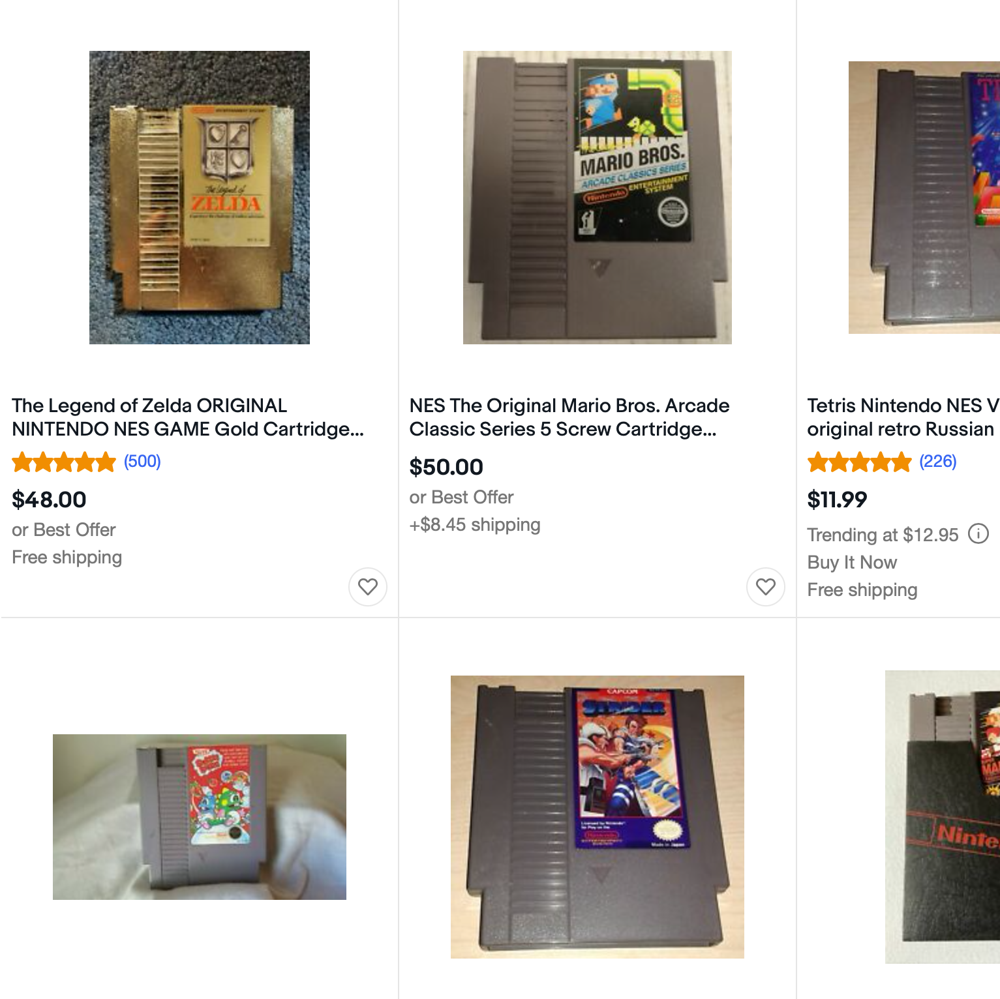
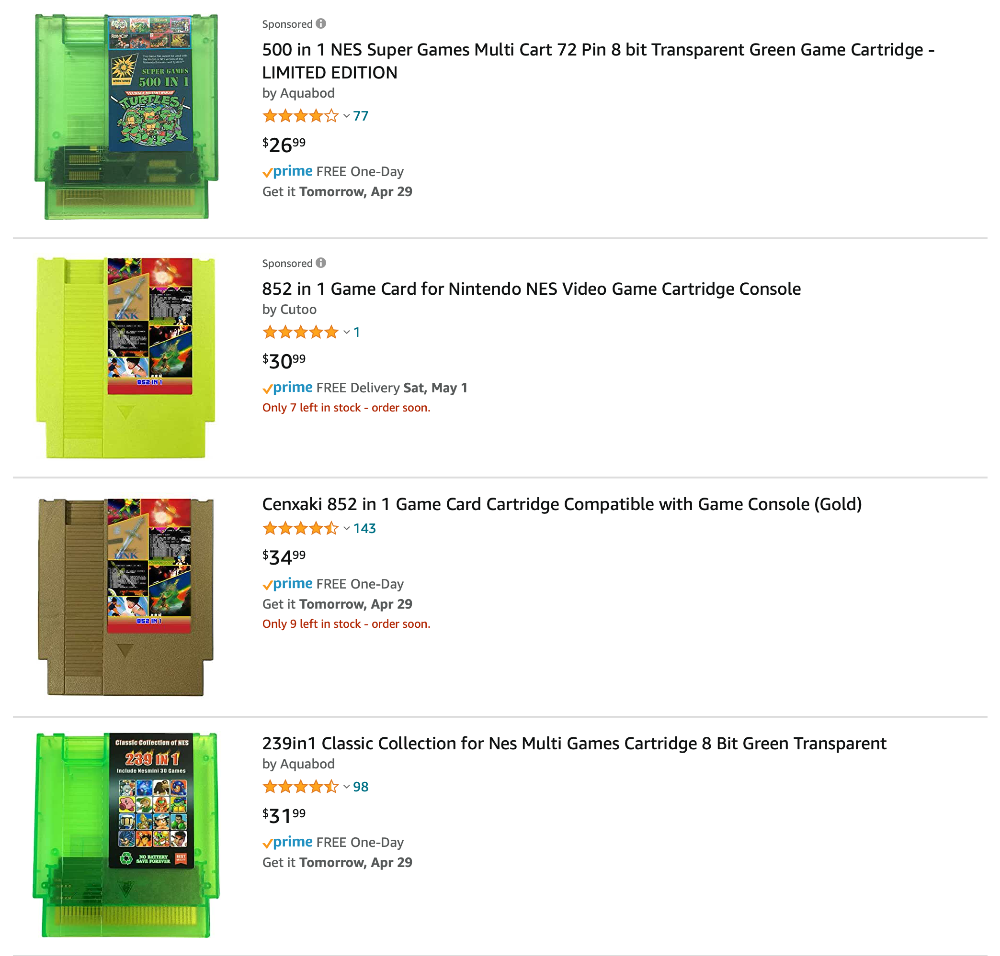

Instead of watching the new <em>Mortal Kombat</em> movie that just dropped on HBO Max, this week I've been going old school and playing <em>Mortal Kombat II</em>. But not the 16-bit Super NES version I played in middle school — it's <a href="https://bootleggames.fandom.com/wiki/Mortal_Kombat_II_(Hummer_Team)">a long-forgotten, unlicensed NES version from Taiwan</a> (which is actually a port of the first <em>Mortal Kombat</em>, not its sequel).

<figure class="wp-block-video"><video controls loop src="//res.cloudinary.com/demaree/video/upload/v1622073615/demaree-dot-me/2021/8bit/mk-nes-fight.mov"></video><figcaption>Gameplay from <em>Mortal Kombat II</em> for NES</figcaption></figure>

As if that weren't complicated enough, there's also <em>how</em> I've been playing it. Whereas a lot of people play retro video games using software emulators like OpenEmu, I'm playing this game on actual console hardware, using a special dongle and app to view the game on my computer.

I just bought an <a href="https://www.analogue.co/editions/nt-mini-noir">Analogue Nt Mini Noir</a>, a beautifully designed and constructed clone of the old 8-bit Nintendo Entertainment System. It's far from my only gadget that can play NES games — I also have the NES Classic Mini that Nintendo released in 2017, as well as the NES app available to Switch Online subscribers. 

The NES Classic Mini and NES Online both use <a href="https://en.wikipedia.org/wiki/Video_game_console_emulator">emulation</a>, where a computer tries to simulate a different kind of electronic system in software. Emulators create a "virtual NES", translating keyboard or controller inputs into signals this fake NES understands and converting its "analog" video output into digital pixels that are displayed on a modern TV or monitor. Both come with dozens of pre-installed games provided by Nintendo, including both their own classics (like <em>Super Mario Bros 3</em>, which Polygon recently — correctly — called the greatest <em>Super Mario</em> game of all time) and seminal third-party games like the original <em>Castlevania</em>.

What's different about the Nt Mini is that it isn't trying to <em>emulate</em> an NES — it's an attempt to fully recreate it at a hardware level:

<blockquote class="wp-block-quote">
The core functionality of the original NES is engineered directly into an Altera Cyclone V, a sophisticated <a href="https://en.wikipedia.org/wiki/Field-programmable_gate_array">FPGA</a>. When it comes to knowledge of the NES, our lead Electrical Engineer is second to none. He spent over 5,000 hours re-engineering the NES via FPGA for absolute accuracy. Unlike the knock off and emulation systems that riddle the market today, you’ll be experiencing the NES free of any compromises.
</blockquote>

An FPGA is a computer processor that can be configured to behave like another processor, which is similar to emulation but operating on a much deeper, more physical level. With an emulator, there is no NES processor, just a modern computer running a program pretending to be one. The Nt Mini's FPGA chip, on the other hand, tries to <em>precisely</em> match how original NES hardware behaved. It works with real cartridges, real controllers, and can output to real analog TVs, enabling things like the Zapper light gun (which can't work on flat-panel TVs, because they have no scan lines) which otherwise would only work with vintage NES consoles.

For people like me who don't have old TVs and Zappers laying around, this is sort of an audiophile-ish thing, like wanting to listen to <em>OK Computer</em> on vinyl. A hardware NES has a different feel than an emulated one. Some of these games are actually a bit harder to play on the Nt than an emulator, because the analog controller input has different responsiveness than I'm used to — but that hardness and jankiness is exactly how these games felt back in the 1990's. There's glitchiness in some of the video, which Nintendo QA didn't let slip through in their official emulated versions, also familiar from my childhood.

I do not have any old NES stuff laying around, but I did want to enjoy a lovingly reconstructed retro gaming experience via premium hardware, so I bought the Nt Mini with an idea that I'd go on eBay to buy some old NES cartridges. Of course, I assumed that NES games would be junk cluttering up someone's closet, and I could pick up a whole collection for a few bucks.

That is not the situation I found.

<!-- wp:image {"id":4302,"sizeSlug":"large","linkDestination":"none"} -->
<figure class="wp-block-image size-large"></figure>
<!-- /wp:image -->

Not only had I not thought about how other people might be looking for the same thing I was, that there was likely a market for these games, but I also hadn't remembered what a <em>pain in the ass</em> original NES cartridges were. Some of these listings call out "new save battery!" (as on one O.G. <em>Legend of Zelda</em> game currently trading at $65), because those old games needed their own power supply to keep things in memory, and of course the original save batteries are 30 years old and are long dead.

But then I searched for "nes cartridge" on Amazon — expecting to find a different set of marketplace-type listings from people — and discovered something incredible.

<!-- wp:image {"id":4299,"sizeSlug":"large","linkDestination":"none"} -->
<figure class="wp-block-image size-large"></figure>
<!-- /wp:image -->

<!-- wp:paragraph -->

In addition to cartridge accessories (carrying cases, etc) and cartridge-themed merchandise (like flasks), there are <em>dozens</em> of these sketchy NES-compatible cartridges, all with over a hundred games that I'm sure the sellers have properly licensed from their original developers. 😉

<!-- /wp:paragraph -->

<!-- wp:paragraph -->

I have no idea where these sit on the emulated-vs-simulated spectrum. I assume that, like the Nt Mini, they're closer to really-real than virtually-real, because they need to work with NES hardware. And I know they do, because I bought one and have been playing it on the Nt, which is almost a real NES.

<!-- /wp:paragraph -->

<!-- wp:paragraph -->

These are NES-compatible game boards, but are based on modern silicon. They have solid-state save game memory that doesn't require batteries, and obviously, they can hold a lot more data than old NES cartridges could back in the 1980's. The one I bought has 239 different games, including all of the 30 titles included in the NES Classic Mini, most/all of those games' sequels, and tons of others too.
