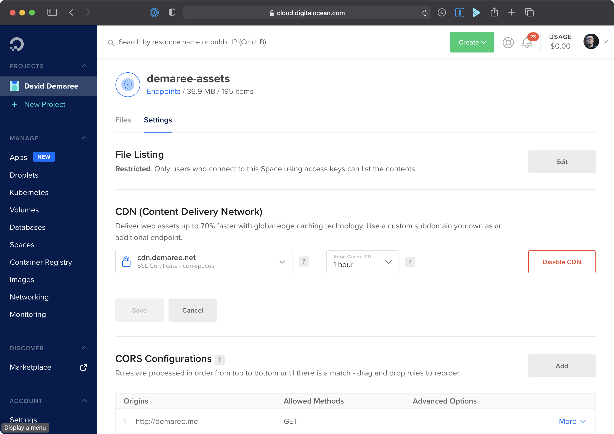
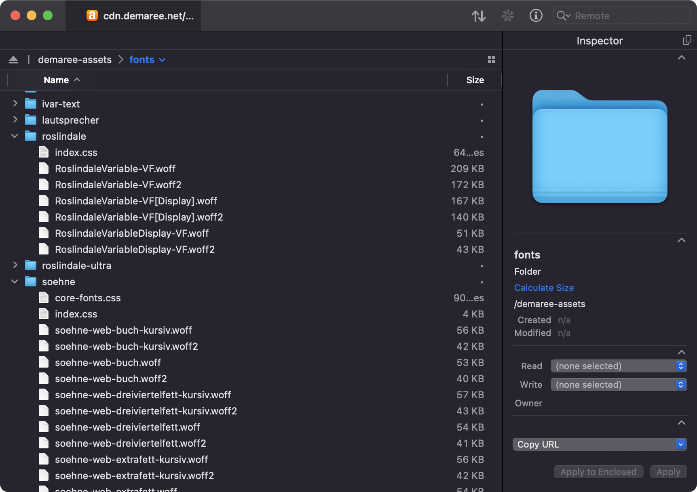
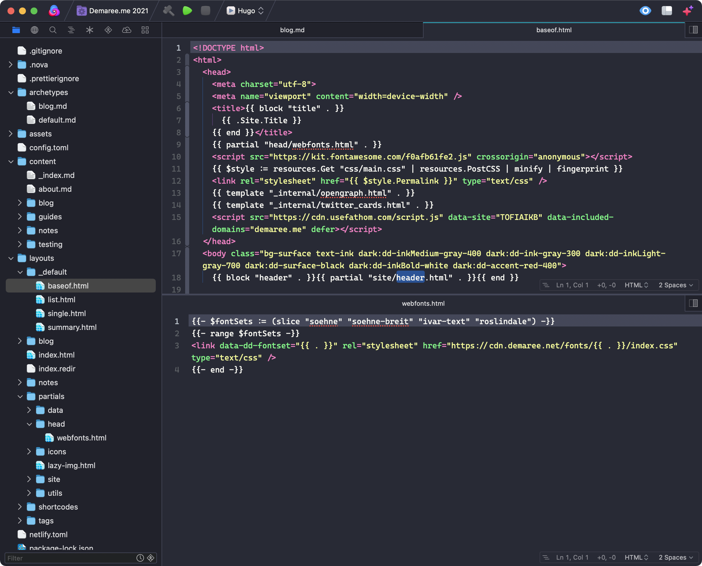

Self-hosting web fonts can be easy; just add the font files somewhere in your site’s directory structure and reference them from your CSS. But if your site’s source code is stored in a GitHub repo, and you want your code to be public (or just forget to make it private), you may accidentally be violating the fonts’ license terms! [Roel Nieskens called GitHub “the web’s largest font piracy site”](https://pixelambacht.nl/2017/github-font-piracy/) due to web developers storing font files in publicly-viewable repos:

> Let's use the [Github search API](https://developer.github.com/v3/search/) and see if we can find the most ubiquitous commercial font on the planet: Helvetica. And yep, more than [100,000 copies are findable on Github](https://github.com/search?utf8=%E2%9C%93&q=extension%3Attf+extension%3Aotf+filename%3A%22helvetica%22&type=Code) … 
> 
> What if you search for MyFonts' products on Github? That's exactly what I did. I skipped generic names that could result in false positives: names like [Black](http://www.myfonts.com/fonts/intellecta/black/), [Latin](http://www.myfonts.com/fonts/woodentypefonts/latin/) or [Text](http://www.myfonts.com/fonts/fw-alias/text/) and fed the rest to the Github search API. The result? Of the deduped list of 29,951 fonts, 7,617 were present on Github - that's a quarter of the entire MyFonts collection. Of their fonts labeled "bestseller", 39 out of 49 can be found on Github, as well as 28 of the 30 labeled "top webfont".

For a while now, I’ve kept my site’s source code private (even though I’d prefer it be public) so that I can store fonts there — it’s just so simple and straightforward to keep fonts and other assets with my code, and by keeping the repo private I can stay in compliance with all my font licenses.

But beyond that, having fonts in a Git repo is an anti-pattern because font files are relatively big binaries, which Git is not super-efficient at tracking or storing. And, because Git remembers everything, every font file I’ve ever used in any version of the site will remain part of the repo forever. Any time I (or Netlify’s build servers) clone a fresh copy, it’ll have to pull down a megabyte or so of font files, only a fraction of which it actually needs.

IMHO, the best idea is to not store web fonts in Git if you don’t have to, but where should they go instead?

My friend [Stephen Nixon](arrowtype.com) — who made the excellent typefaces [Recursive](recursive.design) and [Name Sans](https://name.arrowtype.com/) — [wrote up a nice post explaining why and how he securely hosts web fonts on AWS S3](https://blog.arrowtype.com/host-webfont-on-aws/) :

> With the S3 Buckets feature of Amazon Web Services (AWS), this is relatively easy & very inexpensive – unless you are making a hugely-popular website, perhaps. You can (and should) configure it to only work on specific web domains, so you don’t break your licensing or end up paying for other people to use your font hosting!

[S3](https://aws.amazon.com/s3/) is great — one of very few internet things that is fast, cheap, _and_ good for most use cases, and it’s been that way for more than a decade. Amazon offers a powerful web control panel for working with S3 buckets and data, and there are also many excellent third-party and open source apps that can upload to S3. My favorites are [Transmit](panic.com/transmit/), Panic’s venerable file-transfer client for macOS, and [`s3cmd`](https://sourceforge.net/projects/s3tools/), a Python-based open source command line tool.

For me, the main drawback to S3 is that it can be annoying to serve fonts or other files over SSL. All S3 buckets have default `s3.amazonaws.com` URLs that can be accessed over HTTP or HTTPS, which is great. But S3’s static website hosting features (which you may not need for this, but idk) are only available over regular HTTP, and if you want to leverage those or use a custom domain you’ll have to set up CloudFront, Amazon’s CDN service, which is extremely powerful but also complicated and rather expensive.

Another drawback to S3, less important for small projects but still worth thinking about, is that without CloudFront all your data is served from your chosen AWS datacenter, not from Amazon’s CDN. Some users may see latency or slower downloads, which is exactly what you don’t want with larger assets like fonts. Slow font downloads can block page rendering or exacerbate problems like FOUT.

So,  for the fonts on this site, I decided to use [DigitalOcean Spaces](https://www.digitalocean.com/products/spaces/), an “object” (aka file) storage service that’s patterned after S3, and compatible with S3’s API so that apps like Transmit will work with it. It’s a lot simpler, both in the product itself (nice web UI, easy-to-understand settings) and in its pricing model (a flat $5/month fee), and it has a built-in CDN that can integrate with DigitalOcean’s DNS servers to effortlessly configure custom domains and SSL certificates.

I keep all my fonts in the same directory of the same Spaces bucket, which I manage using Transmit:

Each subdirectory is named after the fonts’ CSS `font-family` name, so that my “API” for using the fonts is consistent. To enable the Söhne fonts, I add a link to `cdn.demaree.net/fonts/soehne/index.css`, and then I can use `font-family: soehne, …` in my CSS. Nice and simple.

Because these directory names and URLs follow a nice, regular structure, I can lightly automate adding these links in my Hugo templates, providing a list of family slugs that are turned into `<link>` tags. These are hard-coded, but could just as easily be set as front matter data on a page or post.

Now that these fonts are up in The Cloud, I can easily reference them in test pages and experiments without having to copy them over from another project. And because my fonts are out of my Git repo, [I can finally re-open my site’s source code](https://github.com/ddemaree/demaree-next).

Have any questions or comments? Feel free to [file an issue](https://github.com/ddemaree/demaree-next/issues/new), or email me at [demaree@hey.com](mailto:demaree@hey.com?subject=Web+fonts+post).

