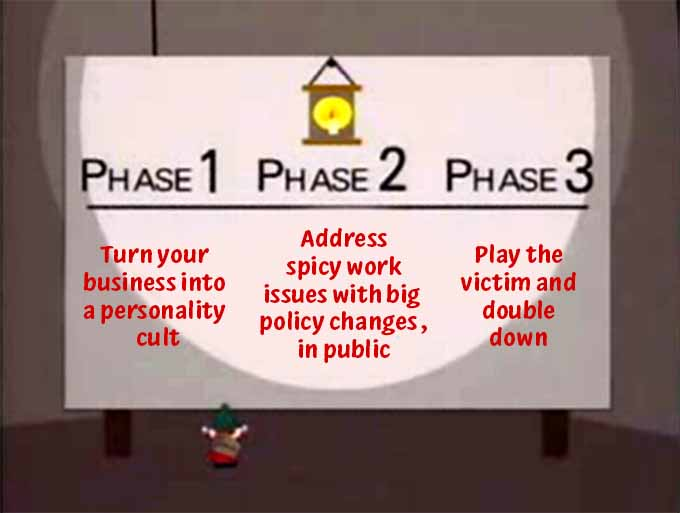

One is an incident, two is a coincidence, but three makes a pattern. Following on Basecamp’s heel turn this week, now [Patreon CEO Jack Conte has posted a YouTube video](https://www.youtube.com/watch?app=desktop\u0026v=MV-3GgU6rlo\u0026feature=youtu.be) announcing [the layoff of _36 people_ from the company](https://www.protocol.com/bulletins/patreon-lays-off-36-employees), despite things going well financially.

<figure class="wp-block-embed is-type-video is-provider-youtube wp-block-embed-youtube wp-embed-aspect-16-9 wp-has-aspect-ratio">

<iframe loading="lazy" title="Some tough news to share" width="674" height="379" src="https://www.youtube.com/embed/MV-3GgU6rlo?feature=oembed" frameborder="0" allow="accelerometer; autoplay; clipboard-write; encrypted-media; gyroscope; picture-in-picture" allowfullscreen></iframe>

</figure>

_Protocol_ reports that:

> Patreon is offering laid-off employees a severance package including three months of full pay, five months of mental health benefits, and health insurance through September, Conte said. The company also removed some stock option restrictions to ensure they get “the full amount of stock compensation,” Conte said. 
> 
> The layoffs come just weeks after <a rel="noreferrer noopener" href="https://www.wsj.com/articles/patreons-valuation-triples-to-4-billion-as-creators-and-fans-flock-to-platform-11617762374" target="_blank">Patreon raised a $155 million funding round at a $4 billion valuation</a>. Patreon is doing better than it’s ever done before, Conte said in the video.
{.wp-block-quote}

The video is uncomfortable to watch, and not just because Conte talks in that first-person confessional “YouTuber style” that I always find awkward and a little bit threatening, like someone has you in their headlights and will not look away.

In a 6.5 minute video, Conte spends the first third talking about how weighty a decision it is, how much he owns the decision, how the company is doing fine financially and the fired individuals are all wonderful, great people. This reminds me of the saying that if someone says something nice followed by “but,” everything before the “but” was bullshit.

I don’t have solid numbers on how many employees Patreon has. Last year, when the company laid off 30 people in response to the (short-lived) economic downturn caused by the onset of the Covid pandemic, [_The Verge_ reported that was 13% of their workforce](https://www.theverge.com/2020/4/21/21230290/patreon-laid-off-layoffs-13-percent-staff-workforce), which would add up to about 230 people. Assuming their headcount either remained flat or only grew a little, today’s layoffs would be roughly 15% of the company.

Why? Conte attributes the change to a shift in product strategy, proposed by the company’s recently-hired chief product officer, saying that the people being let go didn’t have the skill sets or experience needed for this new vision.

What he of course did not say is whether these individuals — who were all designers, engineers, and other tech/product specialists — were given an opportunity to adapt to the new way of working and stick around, or if they plan a big round of hiring to fill their roles. His words seem to say that these people were wrong for the company, but could just as easily mean that they were redundant, making this that other kind of layoff that companies do when they want to improve their financial outlook or shareholder value.

A difference between this video and the blog posts from Coinbase CEO Brian Armstrong and Basecamp founders Jason Fried and David Heinemeier Hansson is that Conte doesn’t bring up politics or culture once — he keeps the focus on, well, himself first and foremost (which is no different from those other dudes), but then on the vaguely-stated notion that the company needs to operate differently in order to be “the best product for creators,” and that those changes necessitate separating 36 people from their livelihoods. 

Conte also, I guess to his credit, didn’t announce a big change to how the company works and then passive-aggressively offer an exit package to anyone who dissents — rather, he just fired the people who he wanted to fire, with similarly generous severance and other benefits such as full vesting of their stock grants.

<figure class="wp-block-image size-large"></figure>

Even so, I would still say that with this video and the changes it discusses, Jack Conte and Patreon have done the thing I have termed <strong>The Full Coinbase</strong>:

First, <strong>start by building your company’s brand on populist or anti-establishment values.</strong> Coinbase is a cryptocurrency platform (which not everyone agrees is pro-people, but many crypto proponents certainly do); Basecamp makes software for distributed work and publishes books and podcasts about “better” ways of working. Patreon is one of the leading platforms for independent creators to monetize their work, enabling those creators (or at least the most popular ones) to monetize and thereby focus more on their art.

Second, <strong>keep all power at the company centralized in one (or few) people, and even make them synonymous with the brand</strong>. As I noted yesterday when linking to the _Rework_ podcast’s 90-second reaction to their bosses’ policy changes, the podcast website doesn’t even list the hosts’ names, but does mention the two Basecamp partners. Jack Conte is not “the Patreon guy” so much as Patreon is “Jack Conte’s startup” — he was a creator before he was a startup founder, and in the video he’s speaking to creators directly as one of them even as he speaks about his employees in the abstract. He owns this decision because (for all intents and purposes) he owns the company and its brand as fully as Jason and David own Basecamp.

Third, having given these leaders both old-timey-tycoon-like power over a company and its operations and a big social media megaphone, <strong>announce a highly controversial policy or operating change affecting dozens of people in a way that centers the _leaders_ more than any of the affected employees</strong>. This is of course the key one, but to have the forceful stink that makes it a Full Coinbase, you need the first two.

In 2019, when [reports of a toxic work environment at Away led to Steph Korey’s downfall as CEO](https://www.google.com/url?sa=t&rct=j&q=&esrc=s&source=web&cd=&cad=rja&uact=8&ved=2ahUKEwiZq-3zhqTwAhV8FlkFHT3PDHYQFjABegQIAhAD&url=https%3A%2F%2Fwww.theverge.com%2F2019%2F12%2F5%2F20995453%2Faway-luggage-ceo-steph-korey-toxic-work-environment-travel-inclusion&usg=AOvVaw0fQzt62pp0Yei4kjqu8hq_), there were a series of public posts from Korey, first taking responsibility and stepping down, then denying responsibility and coming back. But this was far from a Full Coinbase (or even a partial Coinbase) because:

<ul><li>No one expected Away to behave as if it were a social-impact company — even though their luggage is marketed in an aspirational, Millennial-friendly way, it’s still a consumer product, not a new approach to finance or work</li><li>Reports of toxicity at Away came _before_ any staffing or policy changes were announced publicly, and the dictatorial changes that were eventually made public (such as denying PTO requests from the customer support team) were originally kept private.</li><li>Obviously, while Korey and co-founder Jen Rubio (who has recently, finally, [taken over as the new CEO](https://www.inc.com/tim-crino/jen-rubio-ceo-away-company-culture.html)) enjoyed tremendous power and ownership, _someone_ (e.g. on the board) was in a position to eventually hold the CEO accountable. At the Full Coinbase companies, either all of the senior leaders and board members are on the same page, or no one who disagrees is empowered to do anything about it.</li></ul>

Lastly, to really land a Full Coinbase, you need to <strong>never bluff, and never, ever fold — either stand pat or double down.</strong> Brian Armstrong stood firm; he did some business-press interviews in the first week or so after announcing an end to “politics” at Coinbase, mostly sticking to the story he’d put out in the blog post. Fried and Hansson have doubled or even tripled down — they didn’t originally offer an “agree or leave” severance package to their employees, but they added one after the initial backlash, and subsequently, they’ve given interviews and posted tweets denouncing their critics.

It’s unclear whether Jack Conte will face a similar backlash, and if so how he’ll respond. But if the video is any indication, just as Armstrong, Fried, and Hansson responded to critics by complaining about them to friendly audiences, we may see follow-on videos where Conte talks to “creators” about how he’s doing all of this for them, regardless of who it hurts.

Three is a pattern, but why this, and why now?

[Marco Rogers speculates that these founders know something we don’t](https://twitter.com/polotek/status/1387622573739888646) — maybe it’s concern about workers organizing (as someone suggested in his replies), or they’re aware of some coming shift in the market and want to get ahead of it, or they want to rehire at lower salaries/benefits to try to reset comp expectations for tech workers.

Those are all plausible, but my guess is that it’s even simpler than that. There are two big forces I see here. 

First, like all of us these days, <strong>these CEOs all live in their own self-reinforcing idea bubbles</strong> — but they differ from the rest of us in that their bubbles not only reinforce a set of beliefs but also give them power and money to make reality conform to their beliefs.

These white dudes (and they are all white dudes) are part of a growing backlash against the last century of worker-friendly policies in both the public and private sectors — they’ve now aligned themselves with the libertarian notion that businesses need not exhibit any loyalty to anything but themselves, and nobody is owed anything by anyone. When companies say politics is a distraction, or that individuals aren’t a good fit for a new way of working, the common thread is that the needs of business trump any obligation to individuals who helped build those businesses, and/or that those obligations can be bought out (via severance) like the remaining months on a lease.

In other words, it’s not that these CEOs have some inside scoop about the future that’s forcing them to act preemptively. It’s more like they’ve been clued into the use of severance packages as a Get Out Of Uncomfortable Conversations Free card, and who wouldn’t play that card if they had it and knew they could use it?

Another factor here — and the reason why this is playing out publicly — is that these CEOs are leveraging public opinion, possibly to make themselves feel better about hard choices, but also to kickstart controversy to make unambiguously dickish moves seem, well, more ambiguous. In Conte’s case, he’s getting love from his deeply loyal YouTube fan community:

<figure class="wp-block-embed aligncenter is-type-rich is-provider-twitter wp-block-embed-twitter">

<blockquote class="twitter-tweet" data-width="550" data-dnt="true">
reading the comments on YouTube vs here, very different  "OMG, if only everyone was as kind as Jack – thank you for the transparency"   🧐
— _.just_evan (@evan_just_evan) [April 29, 2021](https://twitter.com/evan_just_evan/status/1387629343984295937?ref_src=twsrc%5Etfw)</blockquote>

</figure>

In the other cases, it’s a mix of pro-business fellow travelers and longtime allies — [Daring Fireball](http://daringfireball.net)’s John Gruber, who’s known Jason Fried for a long time and been a 37signals/Basecamp proponent almost since the beginning, has posted [multiple](https://daringfireball.net/linked/2021/04/28/twitter-hate-machine) [links](https://daringfireball.net/linked/2021/04/27/ride-out-the-storm) that (vaguely, like subtweets) show support for Fried and dismiss the haters.

But, lastly, <strong>I think it’s easy to imagine all of this is happening as a result of Covid, and lockdowns.</strong>

It’s impossible to overstate the ability of in-person offices, and the communities that form there, to paper over problems in company culture and working conditions. For one thing, when micro- (or macro-) aggressions happen in person, there’s no chat history to screenshot, and people can go complain around the coffee machine rather than stewing on problems in their spare bedrooms between Zoom calls.

You can’t separate “politics” or “operating conditions” from the state of the world when everything is on fire, and it’s unreasonable to ask people to leave the world at the door when work has been an unwelcome guest in all of our homes for more than a year. Conversations that might have played out in micro-kitchens and break rooms are happening on group chat and comment threads. Informal groups of underrepresented or marginalized employees are becoming more formalized, because when 100% of the office is virtual, everything has to be more organized and visible than it was. One might imagine that it’s not that teams are engaging in _more_ “political and societal” discussions — it’s that managers and owners have to see and know about it now.

Giving Conte the benefit of the doubt, and taking him at face value that Patreon’s layoffs were about product and not politics, I can easily imagine that WFH was a factor there too. Remote work puts more onus on individual workers to organize their days and their working conditions. You can’t simply tell everyone to show up at the office by 9 and be in a conference room by 11 — your needs have to balance against their lives, and everyone has to do more administrative work to keep it all flowing. 

At a minimum, this all makes organizations less nimble (or seem less nimble) because there’s just more discussion involved in making any of it work. CEOs are used to a world where they say “get this done by Monday,” and the next thing they know it’s Monday and it’s done. They aren’t equipped to be on Slack seeing how the sausage is made — how teams coordinate with each other, complain to one another, how _hard_ it is to get anything done. What to employees is just a normal day at work can look to executives like inefficiency, or worse, like dysfunction.

FWIW, a lot of my job as a middle-tier leader at a big company is carefully managing what my execs hear about and how, because the wrong thing surfaced the wrong way can prompt “concern” or, worse, “help” that ends up causing disruption and stress. This isn’t to say I mislead my bosses — never, ever do that — but I do try to package information with an eye to their POVs and attention spans, because busy leaders are constantly inundated with stuff without context and expect their teams to do this for them. This is why there’s such a thing as an “executive summary.”

That’s all to say, in summary, my guess is that CEOs going Full Coinbase is a function of the following:

<ul><li>Seeing far more of what’s going on in the day to day operations of their companies than they are used to</li><li>People’s lives being on fire, because the world is on fire</li><li>CEOs feeling personally implicated, even attacked, by all of this, and in these cases being a little too empowered to react to it</li><li>Those same CEOs closing ranks and seeking validation when their reactions make them main characters on Twitter</li></ul>

The bad news for those of us who like to see companies be nice to their employees is that, as a tactic, this seems to be working. Basecamp will probably lose some of its squeakiest wheels, and no matter what the future workforce will be smaller, cheaper, and less squeaky. Similarly, Patreon has established that they can simply solve skill or temperament misalignment with cash, and that’s a hard bell to un-ring once it’s been rung.

They’re the latest to go Full Coinbase, but they won’t be the last.
