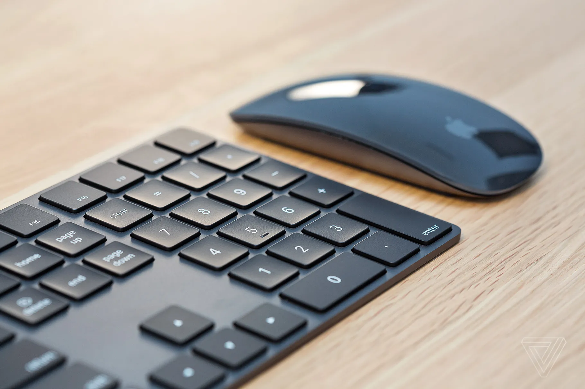

<figure class="wp-block-image size-large"><figcaption>Photo by James Bareham / The Verge</figcaption></figure>

Not that there’s a shortage of black-and-gray computer accessories, but if you happen to like Apple’s Magic Keyboard, Trackpad, and Mouse, _and_ you like things in black, and you don’t mind paying a $20 premium just for the color, you should hop to Apple’s site and grab these while they last because [Apple has discontinued them](https://www.theverge.com/2021/5/14/22436719/apple-space-gray-magic-trackpad-keyboard-mouse-discontinued).

It never made any sense that Apple would charge extra for black, other than that they could and [they’ve done that kind of thing before](https://www.apple.com/newsroom/2006/05/16Apple-Unveils-New-MacBook-Featuring-Intel-Core-Duo-Processors/). I’m hopeful that they’re cleaning house ahead of a big refresh — [maybe one including Touch ID, like the keyboards that come packed with the new iMacs](https://www.theverge.com/2021/4/22/22397196/magic-keyboard-touch-id-m1-mac-macbook-intel) — but it could be as simple as that they’re winding down manufacturing on these alongside the iMac Pro they came with, and it didn’t make sense to keep making them.

Anyway, I’m glad I have some of these around. Apple’s white keys and trackpads can get hella dirty.
