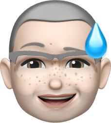

<figure class="w-32 mx-auto mb-6">

</figure>

Hi, I'm David. I love code, cameras, coffee, and cocktails. (Also alliteration.) {.home-hed .font-display-serif .text-4xl .leading-tight .mb-4 .mx-auto .max-w-content}

I live in the NYC suburbs with [my wife](https://instagram.com/jdweinmann), our 5-year-old kid, and [a French bulldog](https://instagram.com/johnny.cash.frenchie). {.home-hed .font-serif .text-2xl .mb-3 .mx-auto .max-w-content}

I've been making web sites and web software for 25 years, starting with little toy projects in high school and college, but more recently leading design and typography teams at big-ass companies. As of 2020, I'm product lead for [Google Fonts](https://fonts.google.com) and also helping out with [Material Design](https://material.io). {.text-2xl .font-serif .mx-auto .max-w-content}