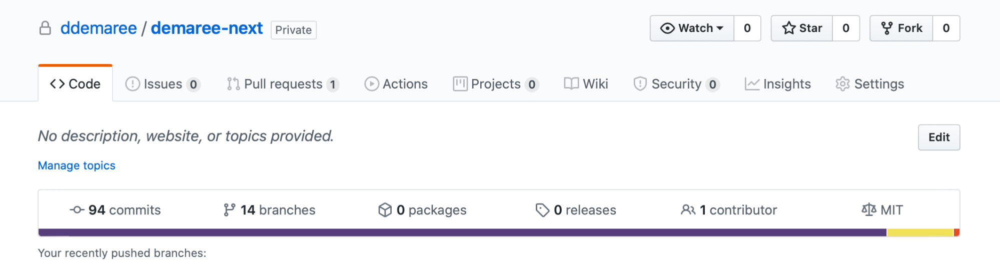
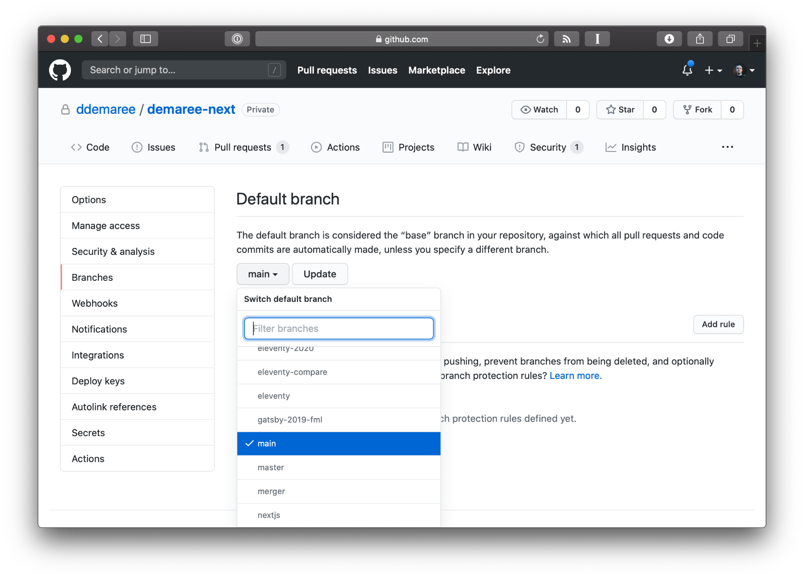
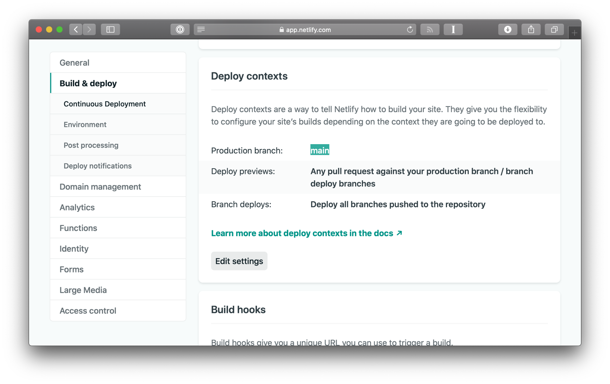
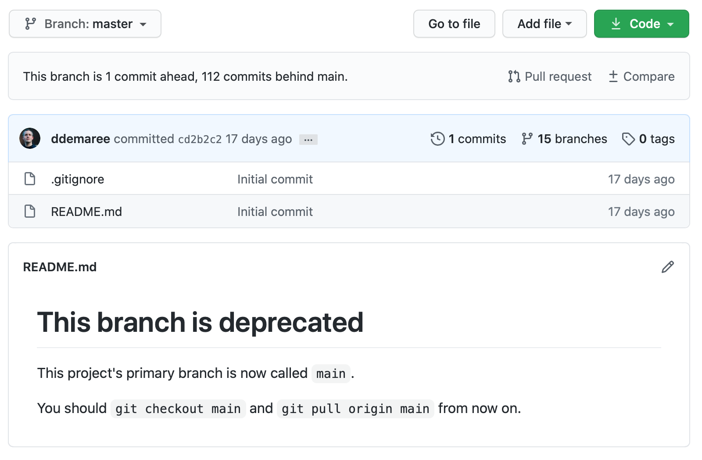

<figure>
  
  <figcaption>
    Photo by <a href="https://unsplash.com/@jack_anstey">Jack Anstey</a> on <a href="https://unsplash.com/s/photos/river">Unsplash</a>
  </figcaption>
</figure>

In my book [Git for Humans](https://abookapart.com/products/git-for-humans), published in 2016, I made copious references to `master` as the primary branch name used in Git repositories. `master` is the longtime default branch name in Git—when you create a new repository, its first branch will be called `master`, and (at the time I’m writing this in July 2020) you actually have to go out of your way to name your primary branch anything else.

In computer contexts, the word “master” can refer to a "master copy," meaning the original or canonical version of something, from which other copies are made. But [its primary meaning in the English language](https://www.vocabulary.com/dictionary/master) is "a person who has general authority over others." And, especially in American and British English, it's hard to separate the word "master," and that meaning of it, from another related word: "slave."

If we're being honest, folks in tech have known that "master" and "slave" are problematic terms for a while, even if they haven't felt motivated to change them. Some would argue that if these words refer to objects or systems, rather than people, then they can't be offensive, just as people argue that tech is a meritocracy and algorithms can't be biased.

But you can't separate the word "master" from its real-world connotation — in fact, it's the connotation that gives it meaning. And before you argue that Git refers here to “master copy”, and not “master/slave”, [it turns out that Git inherited its use of “master” from a prior SCM tool, BitKeeper—which did use “master” and “slave” in its lexicon](https://mail.gnome.org/archives/desktop-devel-list/2019-May/msg00066.html).

Now it’s 2020, and here in the United States, we’re having a national reckoning with our long history of racism and injustice. I believe we have a moral imperative to make a more inclusive world, and to take whatever opportunities we find to progress toward that.

That means it’s high time for `master` to go.

I'm writing this post for the same reason why I wrote _Git for Humans_: people have to live in a Git-based world, and Git does not make that easy. Regardless of whether changing a branch name makes a difference in the lived experience of our Black neighbors and colleagues, the community has begun moving to `main` in earnest.

In a few years, the ecosystem will have evolved to a point where this simply is how it is, and Git and related tools will Just Work (well, as well as they ever do) with less racist names.

As I said, my book (which most people have read in ePub format, but also tragically exists in print) was written with many references to `master`. I am talking to the awesome team at A Book Apart about updating Git for Humans to remove most references to `master`. They’re pretty busy, and there’s still a pandemic happening, so no ETA on when a book update might ship, but I’m working on it!

In the meantime, here is some _Git for Humans_ bonus content: how to rename your primary branch, in both new and existing repos, and set different defaults in your favorite Git-based tools.

## Why rename `master`? (And why _not_?)

My colleague Una Kravets summarized the argument for renaming to `main` super well in [a tweet](https://twitter.com/Una/status/1271181775130279936?s=20):

https://twitter.com/Una/status/1271181775130279936?s=20

To [Bryan Liles’ point](https://twitter.com/bryanl/status/1278343673672011776?s=20), there are also reasons _not_ to do this right now.

https://twitter.com/bryanl/status/1278343673672011776?s=20

Moving _to_ `main` signals a desire for inclusion, a nice signpost for any underrepresented folks who we may collaborate with now or in the future.

But moving away _from_ `master` breaks things. The `master` branch name is what I call a “load-bearing” technical design decision. Many other systems and workflows depend on it, and changing it can break things, such as Git-based package managers like Homebrew that haven’t fully updated to new terminology.

For many Black technologists, seeing white tech folks spend time on cosmetic stuff while injustice rages on can actually feel worse than seeing us do nothing, especially if our cosmetic changes have unintended consequences for the communities we say we're trying to help.

I have some more thoughts on this, but I'll save them for the end. For now, I'll just say this is a more than fair point, and if you're considering making this change on an existing project, you should be thoughtful about who you're making it for and how it will affect them.

From my perspective, while changing branch names in an existing project can be fraught with peril, adopting better names for any new repos you create going forward should be a no-brainer. It's a small thing, long overdue, but there's no time like the present to start doing it.

In fact, [GitHub has even announced they’re gonna help with this by changing the default for everyone](https://www.zdnet.com/article/github-to-replace-master-with-alternative-term-to-avoid-slavery-references/) for newly created projects (though AFAIK this hasn’t shipped yet).

Until that's done, however, you'll need to do some legwork to adopt different names.

## The easy part: creating your new primary branch

While `master` is a long-standing convention, one of the great things about Git is that it doesn't really require your main branch to be named `master` (or anything else). You can choose any name you want, and you can change names at any time, so long as you're willing to do some work.

I chose to rename my personal site's main branch to `main`, to align with what’s emerging as the new standard nomenclature. I also considered naming it `stable`, as a subtle reminder that stuff in that branch is meant to be, well, stable (whereas breaking changes can and should live in other branches). One side benefit of us grappling with this issue right now is that, going forward, the Git ecosystem is likely to be a lot more tolerant of non-standard branch names, so either of these should work, as would `primary`, `production`, `fhqwhgads`, or anything else that makes sense for your project.

In an existing Git repo, the simplest way to switch names away from `master` is to just create a new branch and start using that one instead:

```
git checkout master # if you're not already there
git checkout -b main
```

Alternatively, if checking out `master` is not convenient, you can use `git branch` to create a new branch based on its current commit:

```
git branch main master
```

Either way, your `master` branch will be left intact, and a new `main` branch is created that's an identical copy of `master`, which you can use instead for all the things you used to do with `master`.

Before you forget, make sure to push `stable` to GitHub (or whatever remote server you use):

```
git push -u origin main
```

At this point, a new `main` branch exists, but no one is using it yet. Next, we need to work on the hard part: switching all the people and things over to the new branch.


## Updating your primary branch in GitHub and other tools

Naming the primary branch ``master`` is a convention, not a rule. But because it's a strong, long-lived convention, a lot of your Git tools probably assume that you're following it. Fortunately, this can also be easy to change.

### GitHub

Open your repo page on GitHub while signed in, and click on the Settings tab.



In the Settings page, click Branches in the left-hand navigation. Then, on the right-hand side, you'll see a drop-down that lets you change the name of your default branch. (Remember, though here you see me changing it to `main`, you could set it to `stable` or whatever name you chose.)



Once this is done, new pull requests will automatically be set up to merge into `main`, and `git clone`s from GitHub will also check out `main` by default.


### Netlify

A whole lot of people use Netlify to publish and host static web sites, and a lot of those people use Netlify's Git/GitHub integration to automatically publish changes when you push to your default branch.

If you (like me) are one of those folks, you'll need to go into your Netlify site settings to select a new production branch. This is under _Build & deploy > Deploy contexts_.



### Other integrations

If you have complex integrations with your Git projects, such as continuous integration or deployment systems, before making these changes — and certainly before you delete or disable the old `master` branch — you should talk with your team and make a plan for how to update everything to use a new name.

Depending on the size and scale of your project, this may require changing some files in your repo or some settings in your hosting or other service providers, but may also require some dev-ops type work to plan and roll out a change. In my opinion, this work is worth doing, and the sooner the better, but you should balance the urgency of adopting more inclusive terminology with ensuring a stable experience for your users.


## The hard part: getting rid of the old branch

Sadly, Git doesn't have any such thing as "branch redirects." If all you do is create a new branch named `main`, your teammates may keep pushing changes into `master`, and systems that hook into your repo will keep treating `master` as the main branch.

Hopefully getting collaborators to change names should be as simple as talking to them, telling them you think `main` (or whatever) should be the main branch name going forward, and that they should treat it as such.

Of course, muscle memory can be very strong. Even on a team that agrees to use `main` instead of `master`, someone might push changes to `master` out of habit. If you want to make pushes to `master` trigger an error, one simple thing you can do is to replace the content on your `master` branch with a commit that's disconnected from the rest of your repo. 

Not to be a broken record on this, but before you follow any of the instructions below, make sure you’ve taken a thoughtful look at all the ways people interact with your repo. If you have CI systems or build rules that expect your primary branch to be called `master` — or, for that matter, expect that all your branches contain runnable code — you may need to do extra work to create a placeholder branch like the one I describe here without breaking things. (Otherwise, you’ll end up doing extra work to fix things, which is less fun.)

First, you'll want to create an "orphan" branch, which (as the name implies) is a branch/commit with no parent. Ultimately, this will be a mostly-empty branch that will replace the current `master` branch. We’ll name this new orphan branch no-masters.


```
git checkout --orphan no-masters
```


Then remove all the content from the repo while in this branch. Using `git rm` (as opposed to regular 'ol `rm`) will only delete files and folders that are checked into Git, leaving behind ignored content.


```
git rm -fr .
```

Depending on the technology stack you use, this may leave behind some content that had previously been hidden by `.gitignore`, which will now show up when you run `git status`. You can restore the `gitignore` file to make sure these files are not committed or deleted:

```
git checkout stable .gitignore
```

Lastly, you may want to leave a note explaining why this branch is empty. We'll add and commit a `README.md` Markdown file with the following text:

```
# This branch is deprecated
This project's primary branch is now called `main`.
You should `git checkout main` and `git pull origin main` from now on.
```

Then you can commit these changes:

```
git add .gitignore README.md
# … output deleted …
git commit -m "Deprecation message for `master` branch"
```


Because this is an orphaned branch, if you run `git log` you'll only see this commit, none of the history before it:


```
git log --oneline
> cd2b2c2 (HEAD -> no-masters) Deprecation message for `master` branch
```


OK, now for the scary part — replacing `master` with this content. Which means deleting your old `master` branch:

```
git branch -D master
```

This will delete `master` locally, allowing you to create a new `master` branch that points to this new, empty-except-for-deprecation-message commit.

```
git branch master no-masters
```

If you were to then `git checkout master`, you'll see the deprecation message.

```
git checkout master
git log --oneline
> cd2b2c2 (HEAD -> master) Deprecation message for `master` branch
```

Whew. Okay. One last step: pushing this `master` branch to GitHub. Because this is a new, orphaned branch, you will need to force-push. This may (hell, probably will) break any integrations you have hooked up to `master`, so you may want to wait until your team and infrastructure are fully migrated over to `main` until you do this.

```
git push -f origin master
```

Ahhhhhhhhh, so nice to have that done. Here's the deprecation message as shown on one of my GitHub repos:



Because `master` now points to this orphaned commit, whenever you or someone on your team tries to pull from it Git will raise an error:


```
git pull origin master
From <your-repo-url-here>
 * branch            master     -> FETCH_HEAD
fatal: refusing to merge unrelated histories
```

If only it was this easy to break free from history in real life.

## Speaking of history

Sadly, it's not that easy.

Black Americans have lived with small and big reminders of slavery for their whole lives. In Birmingham, Alabama, where I grew up, activists recently succeeded at [having a Confederate monument removed that had been there for 115 years](https://www.nytimes.com/2020/06/02/us/george-floyd-birmingham-confederate-statue.html).

Birmingham is a largely Black city, that has had Black city leadership since I was a toddler. And folks there have lived with that monument, and the culture that created and protected it, for generations. They've walked past it to go to the library or the art museum.

A racist statue is no less racist because people are able to walk past it on their way to work or school. But racism encoded into a monument isn't nearly as harmful as the racism that prevents people from walking around in public spaces safely, or that makes it so that the jobs they're walking to are unsafe and never pay enough. A movement against racism that takes down statues but leaves behind injustice isn't worth a damn.

Git's `master` branches, and other similar language we use in our working life, are echoes of racism. It's important to reject them and actively choose to do better. It's also a small gesture, and it's only as strong as one's deeper rejection of — and commitment to fight — racism and inequality however you can, whenever you can.

By all means, we should (thoughtfully, carefully) change `master` to `main` (or really _anything_ else). But there's a non-trivial chance that many of us are working to change branch names for organizations that have zero Black members. _That_ is the real problem that needs solving, and sadly Git commands are not enough.

If you're unclear on what those other things are, start by following some Black tech voices — [Tiffani Ashley Bell](https://twitter.com/tiffani), [Del Johnson](https://twitter.com/DelJohnsonVC), [Mekka Okereke](https://twitter.com/mekkaokereke), [Michael Harriot](https://twitter.com/michaelharriot) to name just a few great ones  — and listen to what they say. Follow some more folks; boost their signal.

Some of the things 