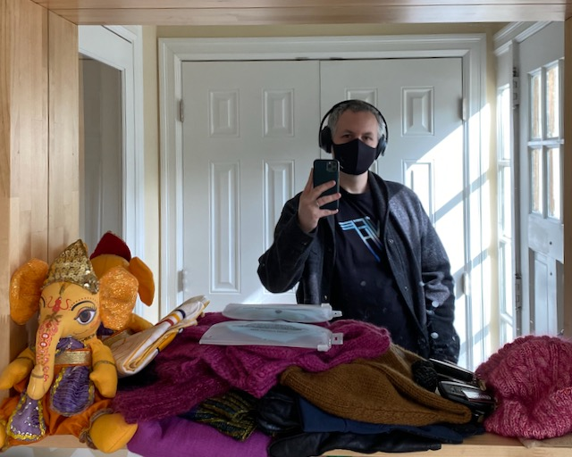

This is a test markdown page. Here I'm experimenting with moving my CMS out of WordPress and straight into Gatsby. How is this developer experience?

Main problem I see is that hot reloading causes tweets not to render right. But I can see content hot reload, which is great!

https://twitter.com/ddemaree/status/1271201601693384707

Here is some code:

```
{
  title: "Test markdown page"
}
```

And here is an Instagram embed:

https://www.instagram.com/p/CBQvFtupIZR/

A big question for tomorrow: how do images work?

